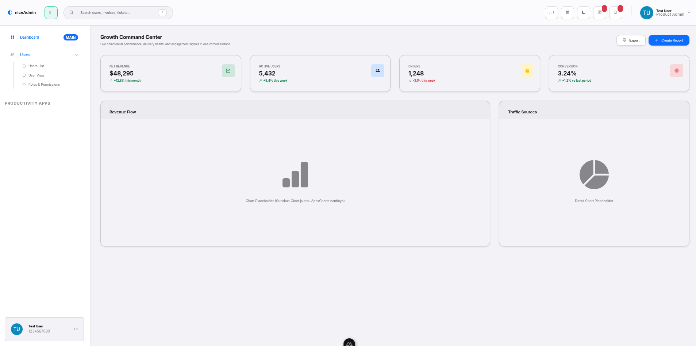
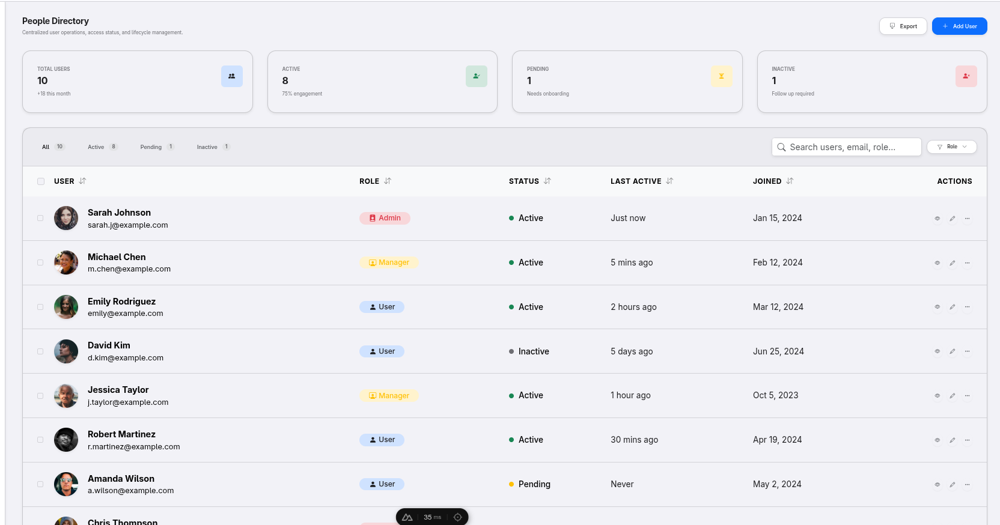
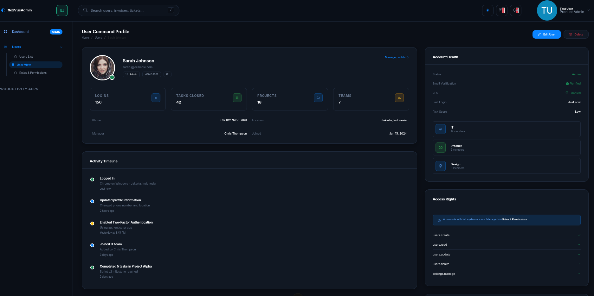

# Flex Vue Admin - Nuxt 4 Administration Dashboard





A scalable, production-ready administration dashboard application built using **Nuxt 4** and **Vue 3**. This project strictly implements **Clean Architecture** principles to decouple business logic from the UI framework, enhancing code maintainability, testability, and long-term scalability.

---

## 🚀 Key Features

- **Nuxt 4 Architecture**: Built using the latest Nuxt 4 "App Directory" structure for superior code organization and performance.
- **Modern & Responsive Interface**: Elegant and responsive custom administration UI built on Bootstrap 5 and SCSS with Apple macOS Sonoma / Fluent Glassmorphism aesthetics.
- **Robust State Management**: Globally integrated with **Pinia** & `pinia-plugin-persistedstate/nuxt` to handle user sessions and tokens automatically with hydration support.
- **Enterprise-Grade Security**: Structured for JWT-based authentication flows, protected with route guard middleware and a Roles & Permissions governance scheme.
- **Smart Form Handling**: Schema-driven form validation infrastructure powered by **VeeValidate** and **Zod**.
- **Dev-Ops & DX Ready**: Automated code quality enforcement using ESLint, Prettier, Husky, and Commitlint (Conventional Commits).

---

## 🛠️ Tech Stack

- **Framework**: Nuxt 4 / Vue 3 / TypeScript
- **State Management**: Pinia + pinia-plugin-persistedstate (Nuxt Module)
- **Styling Architecture**: Bootstrap 5 + SCSS + Custom Glassmorphism System
- **Validation Engine**: Zod + VeeValidate
- **HTTP Client Strategy**: Nuxt `$fetch` (Ofetch) with Repository Pattern
- **Testing Infrastructure**: Vitest + Vue Test Utils
- **Icons**: Bootstrap Icons
- **Static Code Analysis**: Nuxt ESLint Module, Prettier, Husky

---

## 📐 Clean Architecture & Project Structure (Nuxt 4)

Business logic (`domain`, `application`, `infrastructure`) is cleanly extracted out of `app/` to the project root, keeping the Nuxt 4 web framework layer completely isolated from pure business rules:

```text
├── domain/                     # 🧠 Core Business Domain (Pure logic, framework-agnostic)
│   ├── entities/               # Domain entities and models
│   ├── ports/                  # Repository & adapter contracts
│   ├── repositories/           # Domain repository interfaces
│   └── core/                   # AppError, Result, PaginationModel
│
├── application/                # ⚙️ Application Use Cases (Identity orchestrator & flow logic)
│   ├── auth/                   # Login, Logout, GetCurrentUser use cases
│   ├── users/                  # User management use cases
│   └── roles/                  # Role & permission use cases
│
├── infrastructure/             # 🔌 Infrastructure Layer
│   ├── api/                    # HTTP client, endpoints & API error normalizer
│   ├── mappers/                # DTO to Domain model mappers
│   ├── storage/                # Cookie token storage adapter
│   └── __mocks__/              # Development & testing repository mocks
│
├── app/                        # 🖥️ Presentation Web Layer (Nuxt 4 Source)
│   ├── stores/                 # 🗂️ Reactive Global State Store (Pinia)
│   ├── pages/                  # File-based routing system
│   ├── layouts/                # Component layout wrappers (Default, Auth)
│   ├── components/             # Reusable UI components
│   ├── composables/            # Native Vue Composition API logic
│   ├── middleware/             # Route-level interceptor guards
│   ├── plugins/                # Subsystem initialization & Dependency Injection
│   ├── app.vue                 # Nuxt Root Component
│   └── error.vue               # Nuxt Error Page
│
├── server/                     # 🖥️ Nitro Backend (Serverless API & Middleware)
├── assets/                     # 🎨 Compiled static assets (Images, SCSS overrides)
├── public/                     # 🌐 Static files served directly at root
├── tests/                      # 🧪 Testing Suite (Unit & Integration)
└── nuxt.config.ts              # ⚙️ Nuxt framework configuration
```

### 🔄 Target Architecture Data & Execution Flow

The application follows a unidirectional, decoupled data flow according to Clean Architecture principles:

```text
Pages
  │
  ▼
Composable
  │
  ▼
Application (Use Case)
  │
  ▼
Repository Interface
  │
  ▼
Infrastructure Repository
  │
  ▼
HTTP Client
  │
  ▼
Backend API
```

### Architectural Layer Rules:

1. **Pages / Presentation**: Vue components and Nuxt page templates handle UI rendering and user interactions.
2. **Composable**: Native Vue Composition API functions manage local reactive state and invoke application use cases.
3. **Application (Use Case)**: Framework-agnostic application logic encapsulating business workflows and rules.
4. **Repository Interface (Domain)**: Abstraction contract defining required data operations without depending on external infrastructure.
5. **Infrastructure Repository**: Concrete implementation of the repository interface, mapping external API payloads into domain entities.
6. **HTTP Client**: Low-level network wrapper (`httpClient.ts`) providing request/response interception, token attachment, and error handling.
7. **Backend API**: External RESTful server endpoints or Nitro mock servers.

---

## 🔌 Real API Integration & Migration Guide

Thanks to the **Hexagonal Architecture & Dependency Injection (DI)** pattern implemented in this repository, switching from Mock Data to a **Real Backend API** requires **zero changes** to UI components, Nuxt pages, Pinia stores, or domain logic.

---

### 📝 Step-by-Step Guide to Connect Real API:

#### 1. Set Environment Variable (`.env`)

Create or edit your `.env` file at the project root and add your backend API URL:

```env
# Local / Staging / Production API Base URL
NUXT_PUBLIC_API_BASE=https://api.yourdomain.com/v1
```

> **How it works**: The Dependency Injection plugin ([`app/plugins/auth.ts`](file:///srv/http/start-kit-V1/Flex-Vue-Admin.v2/app/plugins/auth.ts)) automatically checks `NUXT_PUBLIC_API_BASE`.
>
> - If `NUXT_PUBLIC_API_BASE` is set ➔ Uses **Real Repositories** (`AuthApiRepository`, `UserApiRepository`, `RoleApiRepository`).
> - If `NUXT_PUBLIC_API_BASE` is empty in development ➔ Falls back to **Mock Repositories**.

---

#### 2. Configure API Endpoints ([`app/infrastructure/api/endpoints.ts`](file:///srv/http/start-kit-V1/Flex-Vue-Admin.v2/app/infrastructure/api/endpoints.ts))

Adjust the endpoint URL paths to match your backend REST API structure:

```ts
export const API_ENDPOINTS = {
  AUTH: {
    LOGIN: '/auth/login',
    ME: '/auth/me',
    LOGOUT: '/auth/logout',
  },
  USERS: {
    LIST: '/users',
    DETAIL: (id: number | string) => `/users/${id}`,
  },
  ROLES: {
    LIST: '/roles',
    UPDATE_PERMISSIONS: (id: number | string) => `/roles/${id}/permissions`,
  },
};
```

---

#### 3. Adjust Response Data Mappers (Optional)

If your backend API returns different JSON key names (e.g., `user_id` instead of `id_personal` or `snake_case` keys), adjust the Data Mapper for that entity:

- 👤 Auth Mapping: [`app/infrastructure/mappers/AuthMapper.ts`](file:///srv/http/start-kit-V1/Flex-Vue-Admin.v2/app/infrastructure/mappers/AuthMapper.ts)
- 👥 User Mapping: [`app/infrastructure/mappers/UserMapper.ts`](file:///srv/http/start-kit-V1/Flex-Vue-Admin.v2/app/infrastructure/mappers/UserMapper.ts)
- 🛡️ Role Mapping: [`app/infrastructure/mappers/RoleMapper.ts`](file:///srv/http/start-kit-V1/Flex-Vue-Admin.v2/app/infrastructure/mappers/RoleMapper.ts)

> **Key Benefit**: Because Data Mappers translate raw API payloads into clean domain entities, **UI pages, Pinia stores, and composables remain 100% untouched**.

---

#### 4. Automatic JWT Token Interception & Error Handling ([`app/infrastructure/api/httpClient.ts`](file:///srv/http/start-kit-V1/Flex-Vue-Admin.v2/app/infrastructure/api/httpClient.ts))

- **Authorization Header**: Automatically attaches `Authorization: Bearer <token>` header to all outgoing HTTP requests once logged in.
- **Unauthorized (401)**: Automatically clears user session/cookies and redirects browser to `/auth/login`.
- **Error Normalization**: HTTP error status codes (400, 401, 403, 404, 422, 500) are converted into user-friendly `AppError` objects.

---

## ⚙️ Getting Started

### Prerequisites

- Node.js (v18.x or later recommended)
- Package Manager: `npm`

### 1. Install Dependencies

```bash
npm install
```

### 2. Run Development Server

```bash
npm run dev
```

The application will be accessible at `http://localhost:3000/`.

### 3. Production Build

```bash
npm run build
npm run preview
```

---

## 🔑 Login Guide & Mock Authentication

For testing purposes without requiring a direct database connection, the application comes equipped with **Mock API (Nitro Server Endpoints)** and **Local Fallback Data**.

### Demo Login Credentials

- **Login Page URL**: `http://localhost:3000/auth/login`
- **Personal ID / Identifier**: `1234567890`
- **Password**: `password`

---

### ⚙️ Authentication Flow Architecture & Design Notes

1. **Dual Parameter Compatibility (`LoginCommand`)**:
   - `LoginUseCase` accepts both `identifier` and `personalId` properties (`LoginCommand`).
   - The application layer automatically resolves `const identifier = (command.identifier ?? command.personalId ?? '').trim()`, protecting against field mismatch errors across legacy and new UI components.
2. **Form Validation & Non-blocking Remember Me**:
   - The "Remember me" checkbox is completely optional and non-blocking during login form validation.
3. **Domain Layer Entity Mapping**:
   - `AuthUser` domain entity exposes both `identifier` and `personalId` (mapped automatically via `AuthMapper.toAuthUser()`), providing clean integration with Pinia auth store getters (`authStore.personalId`).

---

### 📝 Step-by-Step Login Walkthrough:

1. **Run the Application**:
   Open a terminal and execute `npm run dev`.

2. **Open the Login Page**:
   Navigate to `http://localhost:3000/auth/login` in your browser. If you attempt to access `http://localhost:3000/` while unauthenticated, the middleware will automatically redirect you to the login page.

3. **Enter Credentials**:
   - In the **Personal ID** field, type: `1234567890`
   - In the **Password** field, type: `password`
   - _(Optional)_ Check or uncheck **Remember me**.

4. **Click the Sign In Button**:
   - The application will send a request to the Mock API endpoint `POST /api/auth/login`.
   - The access token (`access_token`) will automatically be saved to Pinia state and browser cookies via `cookieTokenStorage`.
   - The application then calls `GET /api/v1/auth/me` to retrieve user profile data (`Test User`).

5. **Page Redirection & Route Guard Protection**:
   - Upon successful login, you will automatically be redirected to the **Dashboard** page (`http://localhost:3000/dashboard`).
   - **IMPORTANT**: As long as the authentication token is stored (until logout), users **CANNOT** navigate back to the login page (`http://localhost:3000/auth/login`). If a user attempts to manually type `/auth/login` in the browser URL bar, the middleware will automatically reject access and redirect them back to the Dashboard.

6. **Verify User Data**:
   The user's name (`Test User`) and Personal ID (`1234567890`) will be displayed in the **Header** (top right) and **Sidebar** (bottom left).

7. **Logout & Token Invalidation**:
   - To return to the login page or switch accounts, the user **MUST** log out to clear the stored token.
   - Logout can be performed by clicking the user profile in the top-right Header and selecting **Sign Out**, clicking the Logout icon in the Sidebar, or navigating directly to `http://localhost:3000/auth/logout`.
   - The logout process invokes the `POST /api/auth/logout` endpoint, clears the Pinia state and browser cookies, and redirects back to `/auth/login`.

---

### 📡 Mock API Endpoints (Demo JSON Data)

#### 1. Login Endpoint (`POST /api/auth/login`)

- **Request Body**:
  ```json
  {
    "id_personal": "1234567890",
    "password": "password"
  }
  ```
- **Response (HTTP 200 OK)**:
  ```json
  {
    "success": true,
    "responseCode": 200,
    "message": "User login successful",
    "data": {
      "access_token": "eyJ0eXAiOiJKV1QiLCJhbGciOiJIUzI1NiJ9...",
      "token_type": "Bearer",
      "expires_in": 3600
    },
    "meta": null,
    "links": null
  }
  ```

#### 2. Get Current Authenticated User Endpoint (`GET /api/v1/auth/me`)

- **Header**: `Authorization: Bearer <access_token>`
- **Response (HTTP 200 OK)**:
  ```json
  {
    "success": true,
    "responseCode": 200,
    "message": "User fetched successfully",
    "data": {
      "id": 9,
      "username": "Test User",
      "id_personal": "1234567890",
      "verify_idpersonal": "2026-07-10 01:20:13",
      "password_show": "password",
      "codeuker": "6617",
      "id_wewenang": 1,
      "is_active": 1,
      "created_at": "2026-07-10T01:20:13.000000Z",
      "updated_at": "2026-07-10T01:20:13.000000Z"
    },
    "meta": null,
    "links": null
  }
  ```

#### 3. Logout Endpoint (`POST /api/auth/logout`)

- **Header**: `Authorization: Bearer <access_token>`
- **Response (HTTP 200 OK)**:
  ```json
  {
    "success": true,
    "responseCode": 200,
    "message": "User logged out successfully",
    "data": null,
    "meta": null,
    "links": null
  }
  ```

---

## 🔍 Detailed Module Flows (Reverse Engineering)

Based on the actual source code structure, the following flows demonstrate how data moves from the Backend API to the Frontend UI for each main module.

### 1. Authentication Flow (Login/Logout)

1. **Page/Component (`app/pages/auth/login.vue`)**: Receives user input (identifier, password) and calls `login()` from `useAuth`.
2. **Composable (`app/composables/useAuth.ts`)**: Calls `nuxtApp.$loginUseCase.execute()` and manages UI loading state.
3. **Use Case (`application/auth/LoginUseCase.ts`)**: Orchestrates the login by calling `authRepository.login()` and saving the resulting token via `tokenStorage`.
4. **Repository (`infrastructure/api/AuthApiRepository.ts`)**: Sends the POST request via `httpClient` and maps the response using `AuthMapper`.
5. **API Client (`infrastructure/api/httpClient.ts`)**: Executes the HTTP request.
6. **Backend Endpoints**: `POST /auth/login` and `GET /v1/auth/me`.

### 2. Dashboard Flow

1. **Page (`app/pages/dashboard/index.vue`)**: Calls `getDashboardStats()` from `useDashboard` on mount.
2. **Composable (`app/composables/useDashboard.ts`)**: Calls `nuxtApp.$getDashboardStatsUseCase.execute()`.
3. **Use Case (`application/dashboard/GetDashboardStatsUseCase.ts`)**: Calls `dashboardRepository.getStats()`.
4. **Repository (`infrastructure/__mocks__/MockDashboardRepository.ts`)**: Currently uses mocked data for dashboard statistics.

### 3. Users Flow (List & Detail)

1. **Page (`app/pages/users/index.vue`)**: Renders data from reactive state `users` and `summary`. Calls `getUsers()` from the composable on mount. Provides interactive UI for `filterUsers()`, `searchUsers()`, `sortUsers()`, `setPage()`.
2. **Composable (`app/composables/useUsers.ts`)**: Manages state via `useState`. `getUsers()` calls `nuxtApp.$getUsersUseCase.execute()`. Handles client-side UI logic like sorting, filtering, searching, and pagination.
3. **Use Case (`application/users/GetUsersUseCase.ts`)**: Forwards the request to `userRepository.getUsers(params)`.
4. **Repository (`infrastructure/api/repositories/UserApiRepository.ts`)**: Builds query string parameters. Executes GET request via `httpClient`. Maps raw response via `UserMapper.toListResult()`.
5. **API Client (`infrastructure/api/httpClient.ts`)**: Injected via `app/plugins/auth.ts`, handles Authorization header and `$fetch`.
6. **Backend Endpoint**: `GET /v1/users` (from `API_ENDPOINTS.USERS.BASE`).
7. **Mapper (`infrastructure/mappers/UserMapper.ts`)**: Converts raw API data into `UserModel` and `UserSummaryModel`.
8. **Entities (`domain/users/models/UserModel.ts`)**: Defines the contract consumed by UI.

### 4. Roles & Permissions Flow

1. **Page (`app/pages/users/roles.vue`)**: Loads `getRoles()` and `getUsers()`. Displays roles and permission matrix. Triggers `togglePermission()` and `saveRolePermissions()`.
2. **Composable (`app/composables/useRoles.ts`)**: Manages `masterRoles` and `permissionGroups`. `getRoles()` calls `nuxtApp.$getRolesUseCase.execute()`. `saveRolePermissions()` calls `nuxtApp.$saveRolePermissionsUseCase.execute()`.
3. **Use Case (`application/roles/GetRolesUseCase.ts` & `SaveRolePermissionsUseCase.ts`)**: Forwards requests to `roleRepository`.
4. **Repository (`infrastructure/api/repositories/RoleApiRepository.ts`)**: Fetches via `httpClient.get` and saves via `httpClient.put`.
5. **API Client**: Handles HTTP requests.
6. **Backend Endpoint**: GET `/v1/roles` and PUT `/v1/roles/{id}/permissions`.
7. **Mapper (`infrastructure/mappers/RoleMapper.ts`)**: Transforms raw booleans into matrix format and groups permissions.

### 5. Menu Navigation Flow

1. **Component (`app/components/layout/Sidebar.vue`)**: Renders the sidebar accordion. Calls `getMenu()` from `useMenu`. Tracks active routes.
2. **Composable (`app/composables/useMenu.ts`)**: Calls `nuxtApp.$getMenuUseCase.execute()`.
3. **Use Case (`application/menus/GetMenuUseCase.ts`)**: Forwards to `menuRepository.getMenu(permissions, role)`.
4. **Repository (`infrastructure/__mocks__/StaticMenuRepository.ts`)**: Dynamically imports static `menu.json` and filters items based on user roles/permissions.

---

## 🧪 Unit Testing

Run the following command to execute the test suite:

```bash
npm run test
```

---

## 🔒 Automated Code Quality Enforcement

- **Husky & Lint-Staged**: Automatically runs ESLint and Prettier on staged files prior to committing.
- **Commitlint**: Ensures commit messages adhere to [Conventional Commits](https://www.conventionalcommits.org/) standards.

---

## 📄 License

This project is licensed under the MIT License - see the [LICENSE](LICENSE) file for details.
